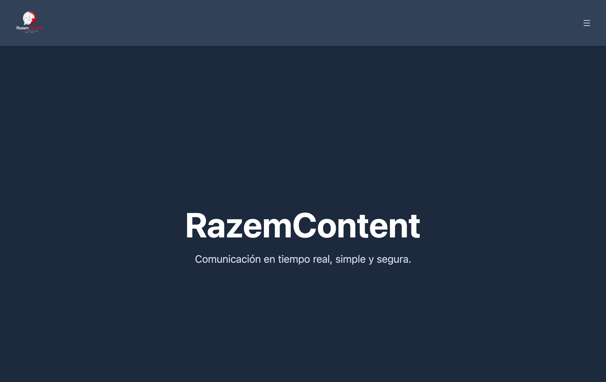
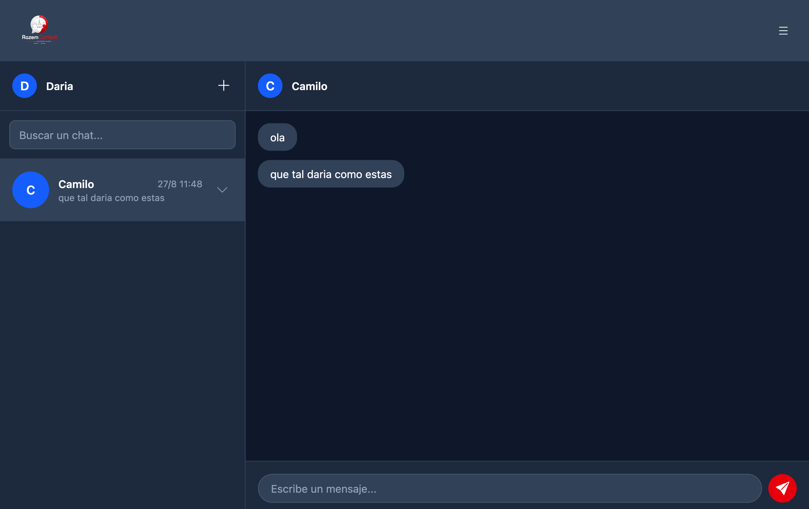
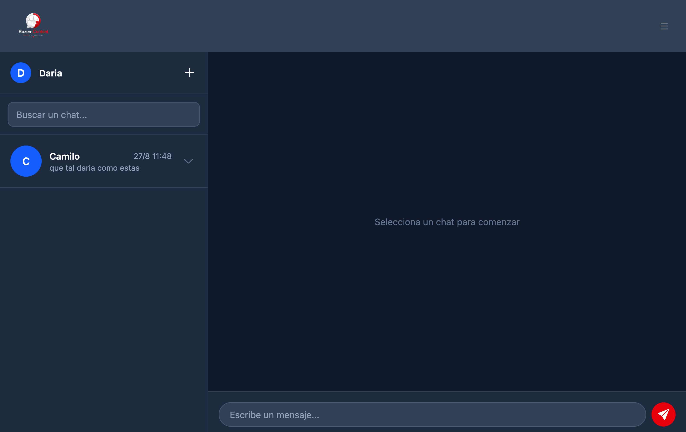
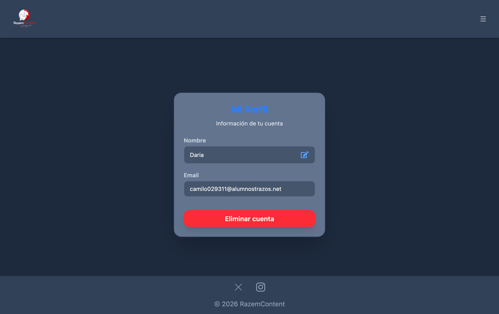

# RazemConnect

Aplicación de chat en tiempo real construida con Vue.js y Node.js. Permite a los usuarios registrarse, agregar contactos y comunicarse mediante mensajes instantáneos, con confirmación de lectura en vivo gracias a Socket.IO.

## 📸 Screenshots

| Home                         | Dashboard                                   |
| ---------------------------- | ------------------------------------------- |
|  |  |

| Selección de chat                                        | Perfil                            |
| -------------------------------------------------------- | --------------------------------- |
|  |  |

## Características

* **Autenticación segura**: registro e inicio de sesión con contraseñas encriptadas (bcrypt) y sesiones mediante JWT en cookies `HttpOnly`.
* **Chat en tiempo real**: mensajería instantánea con Socket.IO, sin necesidad de recargar la página.
* **Confirmación de lectura**: indicador visual (check azul / rojo) que se actualiza en vivo cuando el destinatario lee un mensaje.
* **Gestión de contactos**: búsqueda de usuarios, agregar contactos y eliminarlos.
* **Gestión de conversaciones**: vaciar el historial de un chat o eliminar el contacto completo.
* **Perfil de usuario**: edición de nombre y eliminación de cuenta.
* **Diseño responsive**: interfaz adaptada a escritorio y móvil, con navegación tipo aplicación de mensajería (lista de chats + vista de conversación).
* **Pruebas automatizadas**: cobertura con Vitest sobre componentes, composables y stores.

## Stack tecnológico

### Frontend

* Vue 3 (Composition API)
* Vue Router
* Pinia
* Tailwind CSS
* Socket.IO Client
* Vitest + Vue Test Utils

### Backend

* Node.js + Express
* MongoDB
* Socket.IO
* JSON Web Tokens (JWT)
* bcrypt
* cookie-parser

### Despliegue

* Frontend: Vercel
* Backend: Render

## Estructura del proyecto

```text
RazemConnect/
├── RazemContent/          # Frontend (Vue 3)
│   ├── src/
│   │   ├── components/    # Componentes reutilizables (Navbar, ChatPreview, MessageBubble, etc.)
│   │   ├── composables/   # Lógica de negocio (useDashboard, useMessages, useContacts, etc.)
│   │   ├── stores/        # Estado global con Pinia
│   │   ├── views/         # Vistas / páginas (Login, Register, Dashboard, Profile)
│   │   └── __tests__/     # Pruebas unitarias
│   └── vercel.json
│
└── server/                # Backend (Express + Socket.IO)
    ├── routes/            # Rutas de la API (auth, users, contacts, messages)
    └── managers/          # Gestión de conexiones de Socket.IO
```

## Instalación y ejecución local

### Backend

```bash
cd server
npm install
```

Crea un archivo `.env` en `server/` con:

```env
MongoURI=tu_cadena_de_conexión_de_mongodb
PORT=3000
JWT_SECRET=tu_clave_secreta
```

Inicia el servidor:

```bash
npm run dev
```

### Frontend

```bash
cd RazemContent
npm install
```

Crea un archivo `.env` en `RazemContent/` con:

```env
VITE_API_URL=http://localhost:3000
```

Inicia la aplicación:

```bash
npm run dev
```

## Pruebas

```bash
cd RazemContent
npm run test:unit
```

## Demo

* Frontend: https://razemconnect.vercel.app/
* Backend: https://razemconnect.onrender.com/

---

## 👨‍💻 Autor

**Camilo Acosta** — Desarrollador Full Stack

**Proyecto:** RazemConnect — Aplicación de chat en tiempo real.

**Tipo:** Proyecto de desarrollo Full Stack.

Desarrollado aplicando tecnologías modernas y buenas prácticas de desarrollo web.

**Desarrollado por** [**Camilo Acosta**](https://acostaweb.es/es)

---

### Made with ❤️ by Camilo Acosta

**Razem, zawsze w kontakcie** 💬

---
